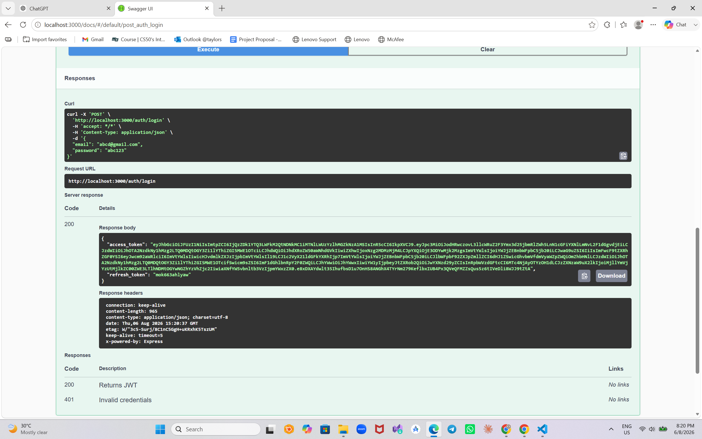
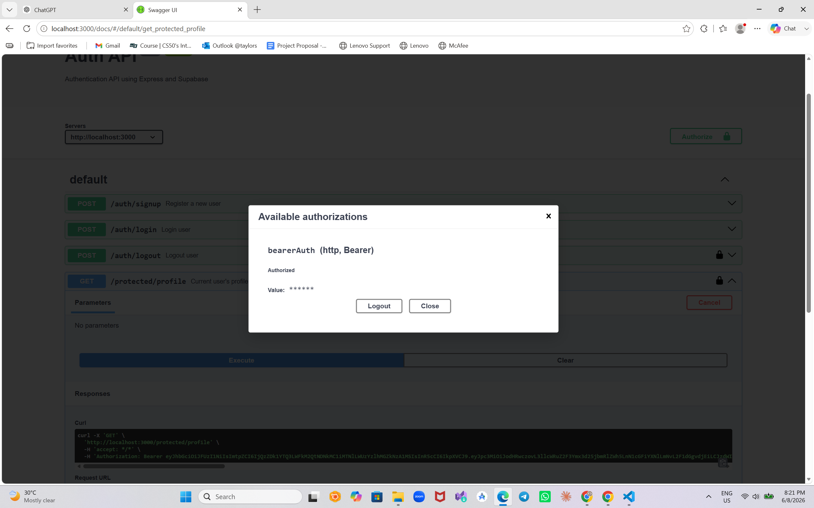
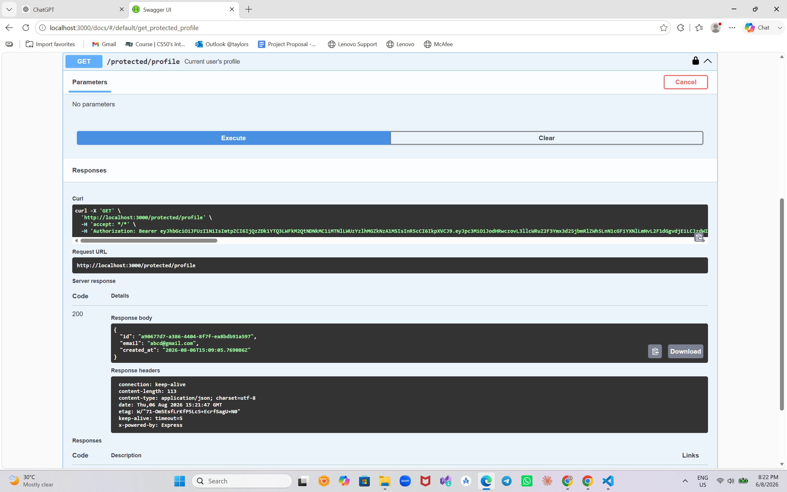

# Auth API - Express + Supabase Authentication

## Overview

This project is a secure REST API built with **Node.js**, **Express**, and **Supabase Authentication**.

It demonstrates a complete authentication workflow including:

* User Sign Up
* User Login
* User Logout
* JWT Authentication
* Protected Routes
* Authentication Middleware
* Swagger UI Documentation with Bearer Authentication

This project was completed as part of the **FlyRank Backend Internship - Week 2 Assignment A4**.

---

# Technologies Used

* Node.js
* Express.js
* Supabase Authentication
* JWT (JSON Web Tokens)
* Swagger UI
* dotenv

---

# Project Structure

```
auth-api/
│
├── authMiddleware.js
├── authRoutes.js
├── publicprotectedRoutes.js
├── server.js
├── supabase.js
├── openapi.json
├── .env.example
├── package.json
├── images/
│   ├── login.png
│   ├── authorize.png
│   ├── profile.png
│   └── dashboard.png
└── README.md
```

---

# Environment Variables

Create a `.env` file in the project root and add necessary credentials needed for this project as noted down below.

Example:

```env
SUPABASE_URL= YOUR_SUPABASE_PROJECT_URL
SUPABASE_KEY= YOUR_SUPABASE_PUBLISHABLE_KEY
PORT=3000
```

A `.env.example` file is included for reference.

---

# Installation

Clone the repository

```bash
git clone https://github.com/h4hash-ch/auth-api.git
```

Move into the project

```bash
cd auth-api
```

Install dependencies

```bash
npm install
```

Create your `.env` file using `.env.example`.

---

# Run the Project

Start the server

```bash
node server.js
```

The server runs on

```
http://localhost:3000
```

Swagger UI is available at

```
http://localhost:3000/docs
```

---

# API Endpoints

| Method | Endpoint               | Authentication | Description                          |
| ------ | ---------------------- | -------------- | ------------------------------------ |
| POST   | `/auth/signup`         | No             | Register a new user                  |
| POST   | `/auth/login`          | No             | Login and receive JWT tokens         |
| POST   | `/auth/logout`         | Yes            | Logout authenticated user            |
| GET    | `/public/info`         | No             | Public endpoint                      |
| GET    | `/protected/profile`   | Yes            | Returns authenticated user's profile |
| GET    | `/protected/dashboard` | Yes            | Protected dashboard                  |

---

# Authentication

Protected routes require a JWT access token in the Authorization header.

```
Authorization: Bearer <access_token>
```

The authentication middleware:

* checks for the Authorization header
* extracts the Bearer token
* verifies the token with Supabase
* rejects invalid or expired tokens
* attaches the authenticated user to the request

---

# Swagger UI

Swagger UI documents all endpoints.

Protected endpoints display a lock icon.

Authentication flow:

1. Register a user.
2. Login to receive an access token.
3. Click **Authorize** in Swagger UI.
4. Paste the access token.
5. Execute protected endpoints directly from Swagger.

---

# Swagger Screenshots

## Login



---

## Authorize with JWT



---

## Protected Profile Endpoint



---

## Protected Dashboard Endpoint


---

# Status Codes

| Status | Meaning                            |
| ------ | ---------------------------------- |
| 200    | Success                            |
| 201    | User created                       |
| 204    | Logout successful                  |
| 400    | Bad request / Missing input        |
| 401    | Missing, invalid, or expired token |

---
# Assignment Features Completed

* Supabase Authentication
* User Signup
* User Login
* User Logout
* JWT Verification
* Authentication Middleware
* Public Route
* Multiple Protected Routes
* Swagger UI Documentation
* Bearer Authentication
* Environment Variables
